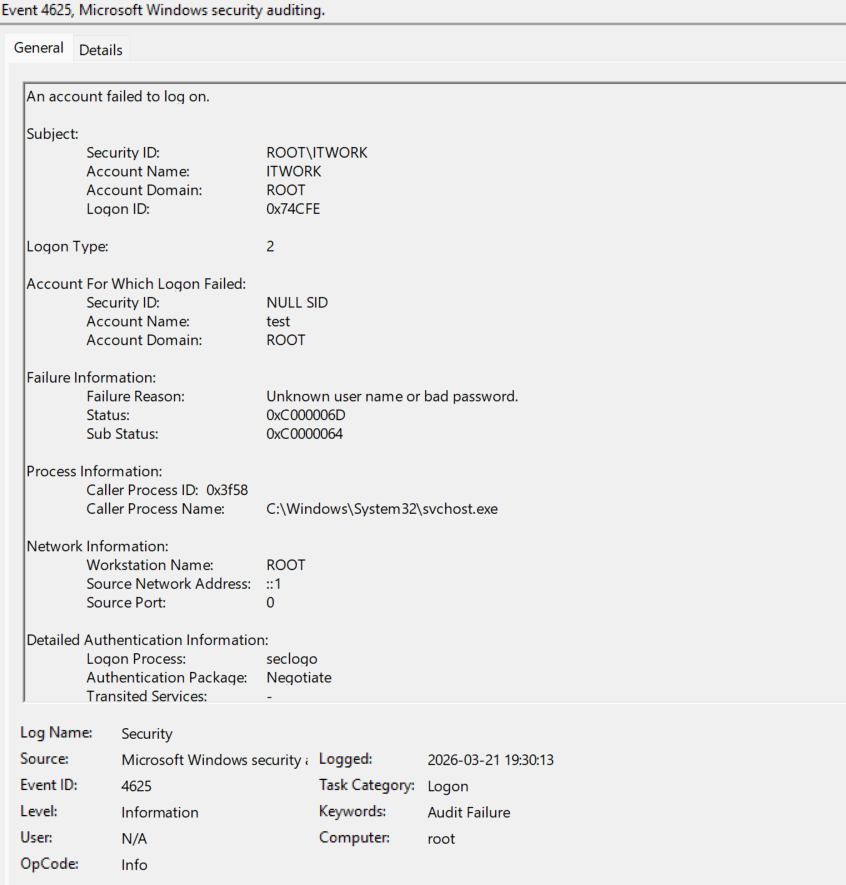
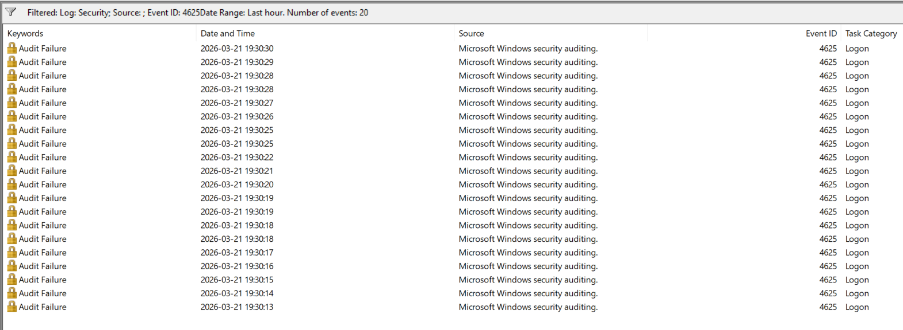
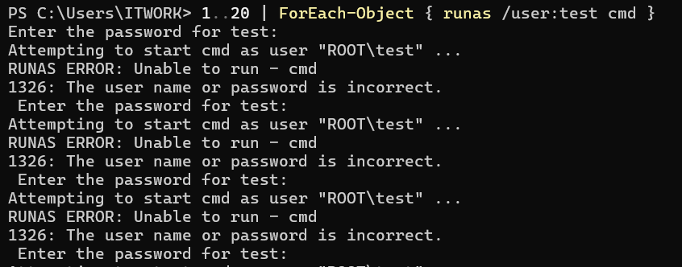
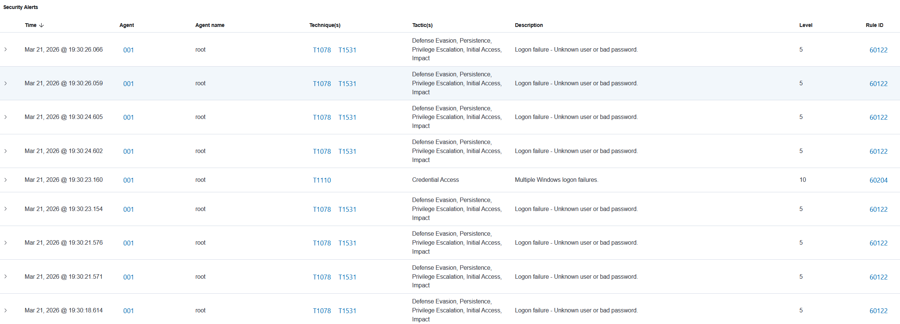
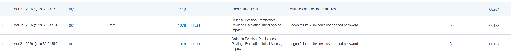
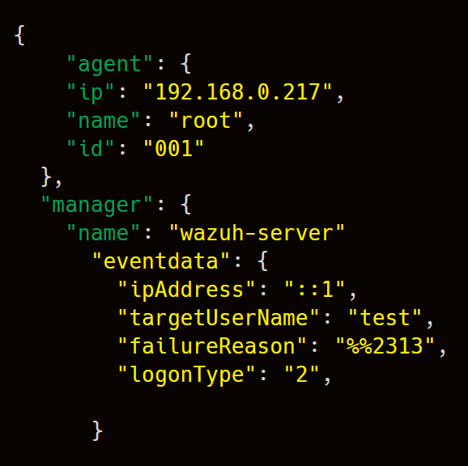

# Brute-Force Detection Lab (Windows + Sysmon + Wazuh)

## 1. Project Summary

This project demonstrates how brute-force login activity can be detected using Windows Security logs and Wazuh SIEM.

The lab simulates multiple failed login attempts within a short time window and shows how:

- raw Windows events are generated (Event ID 4625)
- logs are ingested into Wazuh
- alerts are correlated into a higher severity detection
- analysts can investigate the activity using event details and JSON logs

This project reflects a real-world SOC workflow for detecting credential access attacks.

---

## 2. Objective

The goal of this lab was to simulate brute-force login behavior and validate detection capabilities in Wazuh.

Main objectives:

- generate multiple failed login attempts
- analyze Windows Event ID 4625 (failed logon)
- observe alert generation in Wazuh
- identify correlation into higher severity alerts
- map the activity to MITRE ATT&CK

---

## 3. Lab Environment

### Components used

- **Windows 11** endpoint
- **Windows Security Logs**
- **Wazuh agent**
- **Wazuh SIEM (manager + dashboard)**

### Workflow

1. Multiple failed login attempts are generated
2. Windows logs Event ID 4625
3. Wazuh agent forwards logs
4. Wazuh generates alerts
5. Multiple events are correlated into a higher severity alert

---

## 4. Attack Simulation

Brute-force activity was simulated using repeated login attempts with invalid credentials.

Example method used to simulate brute-force activity:

```powershell
1..20 | ForEach-Object { runas /user:test cmd }

```
This generated multiple failed authentication events within a short time frame.

## 5. Telemetry and Evidence

### Windows Event ID 4625 – Failed Logon

Windows recorded multiple failed login attempts.






This event provides critical information such as:

- target username
- failure reason
- logon type
- source information

### PowerShell Simulation

The brute-force behavior was generated using repeated execution attempts.



### Wazuh Alerts Overview

Wazuh ingested the events and generated multiple alerts.



These alerts indicate repeated authentication failures.

### Correlated Alert (Level 10)

Wazuh correlated multiple failed login attempts into a higher severity alert.



This demonstrates:

- event correlation
- detection of suspicious patterns
- transition from raw logs to actionable alerts

### Wazuh Event Details (JSON)

The raw event data provides detailed visibility into each failed login.



The JSON view exposes raw event fields such as failure reason, target user, and logon type, enabling deeper investigation.

This allows analysts to:

- inspect failure reasons
- identify targeted accounts
- analyze authentication context

## 6. Detection Logic

Detection in this lab is based on:

- repeated Event ID 4625 occurrences
- short time interval between events
- aggregation into a higher severity alert

Detection opportunities:

- brute-force login attempts
- credential guessing
- abnormal authentication patterns

## 7. MITRE ATT&CK Mapping

Observed activity aligns with:

- **T1110 – Brute Force**
- **T1078 – Valid Accounts (potential follow-up)**

## 8. Key Findings

- Multiple failed logins alone are common noise
- Correlation is required to identify real threats
- Wazuh can aggregate low-level events into meaningful alerts
- JSON logs provide deep visibility for investigation

## 9. Skills Demonstrated

This project demonstrates:

- Windows log analysis (Event ID 4625)
- SIEM alert investigation
- detection correlation concepts
- brute-force attack detection
- MITRE ATT&CK mapping
- SOC-style investigation workflow

## 10. Repository Structure

```

Brute-Force-Detection-Lab-Windows-Sysmon-Wazuh/
├── analysis/
├── config/
├── rules/
├── screenshots/
└── README.md

```
## 11. How to Reproduce

1. Configure Windows logging (Security logs enabled)
2. Install and connect Wazuh agent
3. Generate failed login attempts (runas or similar)
4. Observe Event ID 4625 logs
5. Review alerts in Wazuh dashboard
  
## 12. Conclusion

This lab demonstrates how brute-force activity can be detected by correlating multiple failed login attempts.

It highlights the importance of:

- log visibility
- event correlation
- SIEM-based detection
- investigation using raw event data

This workflow mirrors real-world SOC analysis and detection practices.

## 13. Author

Created by Vitalijus Petrovas as part of a SOC / Blue Team portfolio.

